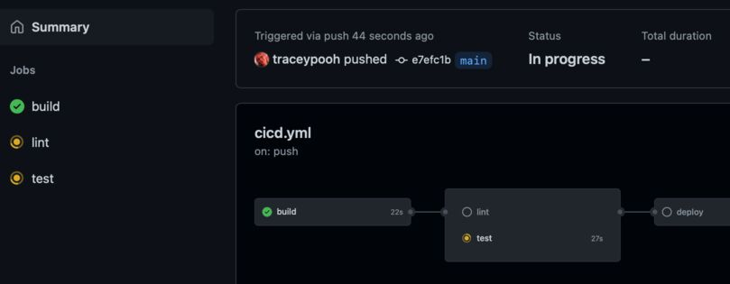

# hello-js

Example of a github repo, using GitHub Actions for a full CI/CD pipeline, with multiple custom test jobs (each using an arbitrary docker image).

See the main CI/CD config here:
- [.github/workflows/cicd.yml](.github/workflows/cicd.yml)

Example pipeline:

